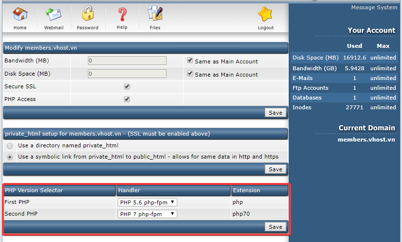

# Cài đặt cấu hình DA

4.1 Cài đặt DA
```sh
# Sử dụng screen để cài đặt 
screen -S DA

# Cài đặt epel và update các bản cập nhật mới cho OS
yum install epel-release perl wget  -y 
yum update -y 

# Tải bản cài đặt từ DirectAdmin 
wget http://www.directadmin.com/setup.sh

# Phân quyền cho file cài đặt 
chmod +x setup.sh 

# Cài đặt
./latest

# Để thoát màn hình screen
Ctrl + A + D
# Để login lại màn hình screen cài đặt DA 
screen -rd DA

# Sau khi cài đặt xong xóa file cài đặt 
rm -rf setup.sh
```

- Truy cập 
http://<ip-public-server>:2222

4.2 Cấu hình DA đa phiên bản PHP 5.6 và PHP 7.0 Quý làm theo các bước sau:

Bước 1:
```sh 
cd /usr/local/directadmin/custombuild
./build set php1_mode php-fpm
./build set php2_mode php-fpm
./build set php1_release 5.6
./build set php2_release 7.0
```

> Lưu ý: với cách cấu hình này thì PHP sẽ chạy ở mode PHP-FPM.

Bước 2: recompile software
```
./build php n
./build rewrite_confs
```
> Để quá trình cài đặt không bị gián đoạn nên cài đặt trong chế độ screen.

Bước 3: Sau khi cài đặt hoàn tất thì đã có thể chọn phiên bản PHP trên DirectAdmin bằng cách truy cập 
Domain Setup --> Chọn Domain và kéo xuống dưới để cấu hình


- Security DA
```

```

- Chỉnh cấu hình DA
```

```

- Create Secure /tmp cho DA
```

```

