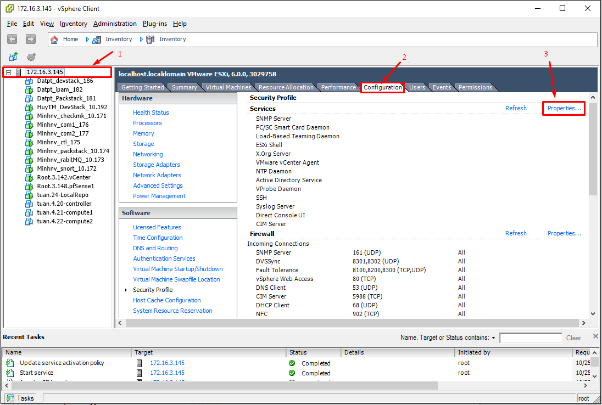
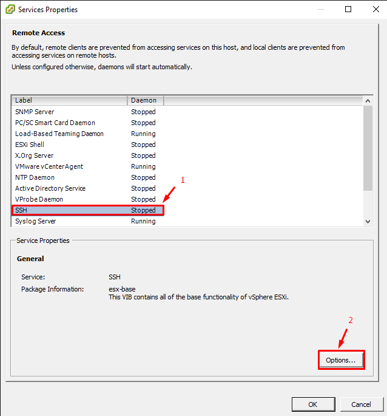
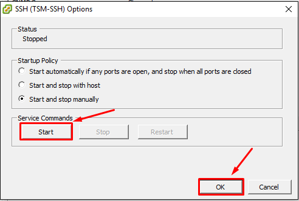
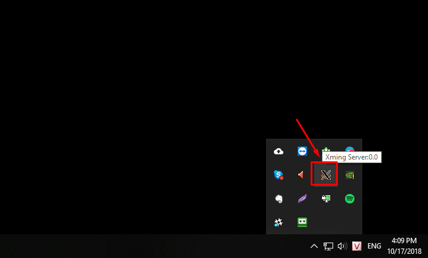
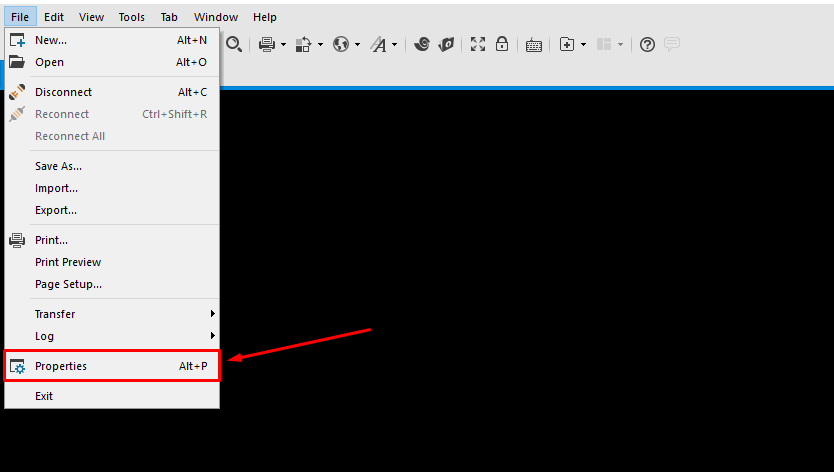

# Chuẩn bị Server cho việc đóng images OpenStack 

Môi trường chuẩn bị:
- KVM node OS: CentOS 7 bản 1804 (Chạy trên ESXi) 
- RAM: >8G
- Disk: 200G 
- CPU: 4x2 Core

## Cài đặt OS 

Tiến hành cài đặt CentOS7 bình thường cho VM

Sau khi cài đặt OS xong Tiến hành shutoff VM đi 
```sh 
init 0
```

## Thực hiện trên ESXi host nhằm enable vmx

> Lưu ý: Nếu KVM đóng Images cài trên Server vật lý thì không cần xử lý bước này. 

- Enable SSH trên ESXi



- Chọn SSH và Start SSH 





- SSH vào node ESXi truy cập vào folder của VM_KVM 
```sh 
cd /vmfs/volumes/datastore1/Canh.KVM
```
> Tùy đường dẫn của VM_KVM bạn lưu ở đâu ở đây VD là Canh.KVM lưu trữ trong datastore1

- Chỉnh sửa file .vmx thêm vào cuối 
```sh 
vhv.enable = "TRUE"
```

- Kiểm tra ID của VM_KVM và reload để nhận config mới
```sh 
vim-cmd vmsvc/getallvms | grep -i <name> 
vim-cmd vmsvc/reload <id>
```

## Thực hiện trên PC

Sử dụng `Xming Server` cài đặt trên Windows để thao tác với `virt-manager` qua X11 khi SSH vào Server KVM.

Download Xming : [https://sourceforge.net/projects/xming/](https://sourceforge.net/projects/xming/)

Sau khi download tiến hành cài đặt Xming-Server và start Xming



Sau khi login SSH, cấu hình X11 sử dụng Xming Server (Ở đây sử dụng Xshell5)




## Thực hiện trên KVM host
Start KVM host lên và cấu hình

Kiểm tra vmx enable trên KVM host
```sh
cat /proc/cpuinfo| egrep -c "vmx|svm"
```

> Nếu OUTPUT câu lệnh trên >0 thì đã enable vmx OK 

Install epel-release và update 
```sh 
yum install epel-release -y && yum update -y 
```

Cài đặt Vm tools
```
yum install -y open-vm-tools wget
```

Cài đặt KVM Node để đóng Images
```
grep -E '(vmx|svm)' /proc/cpuinfo
# WARNING! The remote SSH server rejected X11 forwarding request.
yum install -y qemu-kvm qemu-img virt-manager libvirt libvirt-python libvirt-client virt-install virt-viewer bridge-utils  "@X Window System" xorg-x11-xauth xorg-x11-fonts-* xorg-x11-utils mesa-libGLU*.i686 mesa-libGLU*.x86_64
touch /root/.Xauthority
systemctl start libvirtd
systemctl enable libvirtd
lsmod | grep kvm
virt-manager
# Fix font 
yum install dejavu-lgc-sans-fonts -y
```

Tạo Bridge `br0` cho KVM host để đóng Images thay vì sử dụng NAT trên `virtbr0` có sẵn.
```
# Tạo mới một bridge tên là br0
nmcli c add type bridge autoconnect yes con-name br0 ifname br0
# Gán địa chỉ IP cho bridge mới tạo
nmcli c modify br0 ipv4.addresses 10.10.10.61/24 ipv4.method manual
# Đặt gateway cho bridge 
nmcli c modify br0 ipv4.gateway 10.10.10.1
# Đặt địa chỉ dns cho bridge
nmcli c modify br0 ipv4.dns 8.8.8.8
# Xóa cài đặt card mạng hiện tại
nmcli c delete ens160
# Gán card mạng hiện tại vào bridge br0
nmcli c add type bridge-slave autoconnect yes con-name ens160 ifname ens160 master br0
# Restart network 
/etc/init.d/network restart
```

Disable ipv6
```sh
echo "net.ipv6.conf.all.disable_ipv6 = 1" >> /etc/sysctl.conf
echo "net.ipv6.conf.default.disable_ipv6 = 1" >> /etc/sysctl.conf
sysctl -p
```

Enable `X11Forwarding yes` trong `/etc/ssh/sshd_config`
```sh
X11Forwarding yes
```

Thêm cấu hình `/etc/ssh/sshd_config` để sử dụng X11Forward khi disable IPv6
```sh
X11Forwarding yes
AddressFamily inet
```

Restart SSH
```sh
systemctl restart sshd
```

Tạo folder channel cho các target của VM 
```
mkdir -p /var/lib/libvirt/qemu/channel/target
chown -R qemu:kvm /var/lib/libvirt/qemu/channel
```

Restart libvirt 
```
systemctl restart libvirtd
```

Cài libguestfs-tools để xử lý file `.qcow2` thành file `.img` sau khi cài đặt cấu hình xong VM.
```
yum install libguestfs-tools -y
```

Copy images
```sh
# Copy Images
scp root@10.10.10.61:/var/lib/libvirt/images/*.iso /var/lib/libvirt/images/
# Kiểm tra images
[root@KVM ~]# ls -al /var/lib/libvirt/images/
total 18074212
drwx--x--x. 2 root root       4096 Sep 19 19:39 .
drwxr-xr-x. 9 root root       4096 Sep 19 19:00 ..
-rw-r--r--. 1 root root  427819008 Aug 31  2017 CentOS-6.9-x86_64-minimal.iso
-rw-r--r--. 1 root root  950009856 May 25 12:05 CentOS-7-x86_64-Minimal-1804.iso
-rw-r--r--. 1 root root 2996799488 Sep 18 09:09 SW_DVD5_Windows_Svr_DC_EE_SE_Web_2008R2_64-bit_English_X15-59754.ISO
-rw-r--r--. 1 root root 5400115200 Sep 18 09:04 SW_DVD9_Windows_Svr_Std_and_DataCtr_2012_R2_64Bit_English_-4_MLF_X19-82891.ISO
-rw-r--r--. 1 root root 6003804160 Sep 18 09:37 SW_DVD9_Win_Server_STD_CORE_2016_64Bit_English_-4_DC_STD_MLF_X21-70526.ISO
-rw-r--r--. 1 root root  649068544 Sep  9 09:48 ubuntu-14.04.5-server-amd64.iso
-rw-r--r--. 1 root root  912261120 Sep  9 09:51 ubuntu-16.04.5-server-amd64.iso
-rw-r--r--. 1 root root  851443712 Sep  9 10:09 ubuntu-18.04.1-live-server-amd64.iso
-rw-r--r--. 1 root root  316628992 Aug  5  2017 virtio-win-0.1.141.iso
[root@KVM ~]# 
```

Hoàn tất cài đặt KVM host để đóng Images, Tiến hành đóng Images
