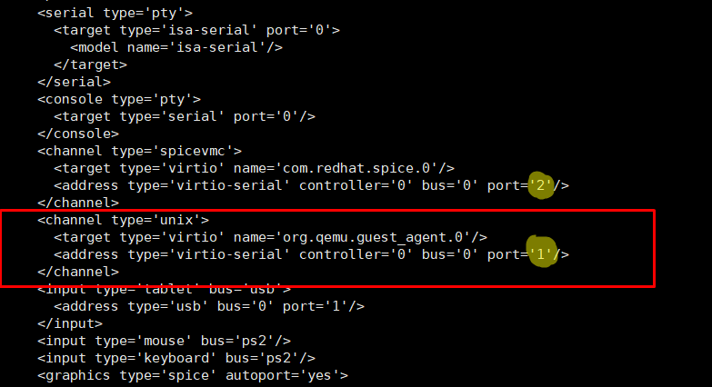
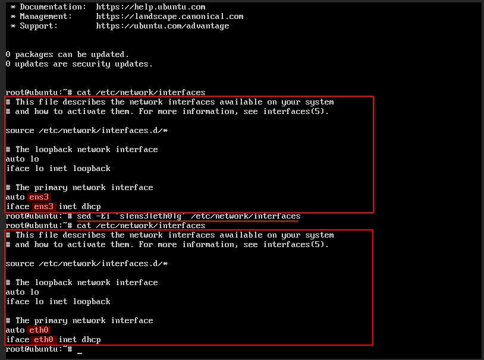
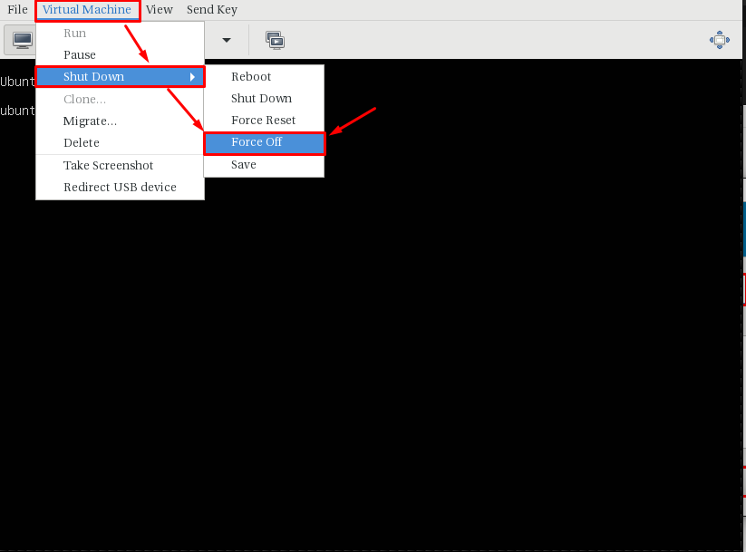
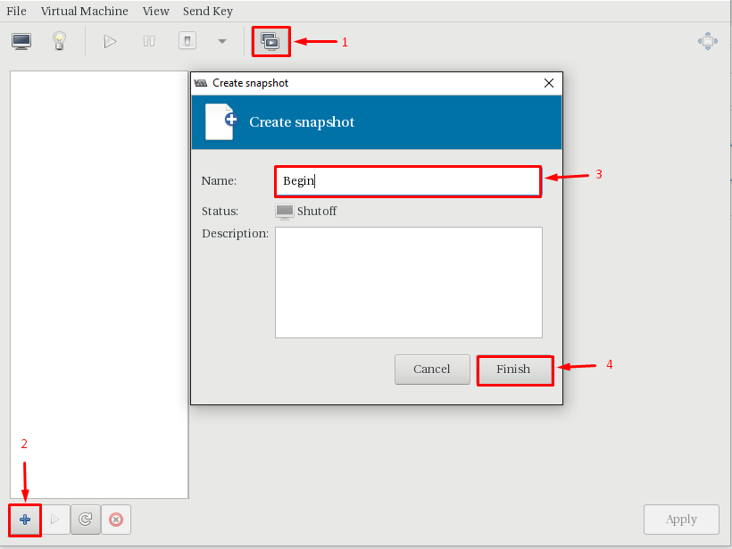
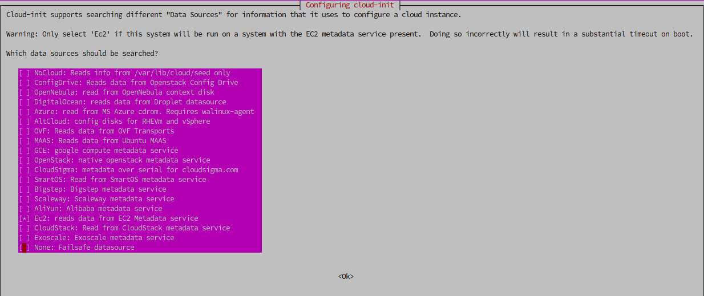

# Hướng dẫn đóng image Ubuntu 16.04 với cloud-init và QEMU Guest Agent (không dùng LVM)

## Chú ý:

- Hướng dẫn này dành cho các image không sử dụng LVM
- Sử dụng công cụ virt-manager hoặc web-virt để kết nối tới console máy ảo
- OS cài đặt KVM là Ubuntu 16.04
- Phiên bản OpenStack sử dụng là Queens
- Hướng dẫn bao gồm 2 phần chính: thực hiện trên máy ảo cài OS và thực hiện trên KVM Host

----------------------

## Bước 1: Tạo máy ảo bằng virt-manager

Các bước tạo tương tự [Ubuntu12](Ubuntu1204.md)

## Bước 2 : Tắt máy ảo, xử lí trên KVM host

- Chỉnh sửa file `.xml` của máy ảo, bổ sung thêm channel trong <devices> (để máy host giao tiếp với máy ảo sử dụng qemu-guest-agent), sau đó save lại

`virsh edit ubuntu16`

với `ubuntu16` là tên máy ảo

``` sh
...
<devices>
 <channel type='unix'>
      <target type='virtio' name='org.qemu.guest_agent.0'/>
      <address type='virtio-serial' controller='0' bus='0' port='1'/>
 </channel>
</devices>
...
```
> Nếu đã tồn tại `channel` đổi port channel này về `port='2'` và add channel bình thường




## Bước 3: Cài các dịch vụ cần thiết

Bật máy ảo lên, truy cập vào máy ảo. Lưu ý với lần đầu boot, bạn phải sử dụng tài khoản tạo trong quá trình cài os, chuyển đổi nó sang tài khoản root để sử dụng.

Cấu hình cho phép login root và xóa user `ubuntu` chỉnh `vi /etc/ssh/sshd_config`
```sh
PermitRootLogin yes
```

Đặt passwd cho root
```sh
sudo su 
# Đặt passwd cho root user
passwd
Enter new UNIX password: <root_passwd>
Retype new UNIX password: <root_passwd>
```

Restart sshd
```sh
service ssh restart
```

Disable firewalld 
```sh
sudo apt-get install ufw -y
sudo ufw disable
```

Logout và login lại bằng user `root` và xóa user `ubuntu`
```sh
userdel ubuntu
rm -rf /home/ubuntu
```

Đổi timezone về `Asia/Ho_Chi_Minh`
```sh
dpkg-reconfigure tzdata
```

Bổ sung env locale 
```sh 
echo "export LC_ALL=C" >>  ~/.bashrc
```

Disable ipv6
```sh
echo "net.ipv6.conf.all.disable_ipv6 = 1" >> /etc/sysctl.conf 
echo "net.ipv6.conf.default.disable_ipv6 = 1" >> /etc/sysctl.conf 
echo "net.ipv6.conf.lo.disable_ipv6 = 1" >> /etc/sysctl.conf
# Kiểm tra config add thành công 
sysctl -p
# Kiểm tra disable ipv6 
cat /proc/sys/net/ipv6/conf/all/disable_ipv6
# Output: 1: OK, 0: NotOK
```

- Cài đặt CMDlog
```sh 
curl -Lso- https://raw.githubusercontent.com/nhanhoadocs/ghichep-cmdlog/master/cmdlog.sh | bash
```

- Cài đặt Chronyd 
```sh
apt install chrony -y
sed -i 's|pool 2.debian.pool.ntp.org offline iburst|pool 103.101.161.201 offline iburst|g' /etc/chrony/chrony.conf
service chrony restart
hwclock --systohc
```

Update 
```sh
sudo apt-get update -y 
sudo apt-get upgrade -y 
sudo apt-get dist-upgrade -y
sudo apt-get autoremove 
```

Cấu hình để đổi name Card mạng về eth* thay vì ens, eno (Để scripts netplug chạy ổn định)
```sh
sed -i 's|GRUB_CMDLINE_LINUX=""|GRUB_CMDLINE_LINUX="net.ifnames=0 biosdevname=0"|g' /etc/default/grub
```

Lưu lại config 
```sh 
update-grub
```

Reboot VM 
```sh 
init 6
```

Login ***Console** và chỉnh card mạng về đúng `eth0` trong `/etc/network/interfaces`
```sh 
sed -Ei 's|ens3|eth0|g' /etc/network/interfaces
```



Thực hiện restart network 
```sh 
/etc/init.d/networking restart 
```

> ## ==> Tắt máy và SNAPSHOT lại KVM host để lưu trữ và đóng gói lại khi cần thiết

- Shutdown VM 



- Tiến hành truy cập tab `Snapshot` để snapshot




## Bước 4: Cài đặt cloud-init, cloud-utils và cloud-initramfs-growroot

```sh
apt-get install cloud-utils cloud-initramfs-growroot cloud-init -y
```

## Bước 5: Cấu hình để instance nhận metadata từ datasource

```sh
dpkg-reconfigure cloud-init
```

Sau khi màn hình mở ra, lựa chọn `EC2` bỏ các option khác 



Disable Warning đối với EC2 trên Ubuntu 16
```sh 
touch /root/.cloud-warnings.skip
```

## Bước 6: Cấu hình user nhận ssh keys

Thay đổi file `/etc/cloud/cloud.cfg` để chỉ định user nhận ssh keys khi truyền vào, mặc định là `root`

``` sh
sed -i 's/name: ubuntu/name: root/g' /etc/cloud/cloud.cfg
```

## Bước 7: Xóa bỏ thông tin của địa chỉ MAC

Xóa nội dung file net rules 
```sh 
echo > /lib/udev/rules.d/75-persistent-net-generator.rules
echo > /etc/udev/rules.d/70-persistent-net.rules
```
> Không xóa file 

## Bước 8: Cấu hình để instance báo log ra console

```sh
sed -i 's|GRUB_CMDLINE_LINUX_DEFAULT=""|GRUB_CMDLINE_LINUX_DEFAULT="console=tty0 console=ttyS0,115200n8"|g' /etc/default/grub
```

Lưu lại config 
```sh 
update-grub
```


## Bước 09: Cài đặt netplug để sau khi boot máy ảo, có thể nhận đủ các NIC gắn vào:

``` sh
apt-get install netplug -y
wget https://raw.githubusercontent.com/uncelvel/create-images-openstack/master/scripts_all/netplug_ubuntu -O netplug
mv netplug /etc/netplug/netplug
chmod +x /etc/netplug/netplug
```

## Bước 10: Disable default config route

```sh
sed -i 's|link-local 169.254.0.0|#link-local 169.254.0.0|g' /etc/networks
```

## Bước 11: Cài đặt qemu-guest-agent


Chú ý: qemu-guest-agent là một daemon chạy trong máy ảo, giúp quản lý và hỗ trợ máy ảo khi cần (có thể cân nhắc việc cài thành phần này lên máy ảo)

Để có thể thay đổi password máy ảo thì phiên bản qemu-guest-agent phải >= 2.5.0

``` sh
apt-get install software-properties-common -y
add-apt-repository cloud-archive:mitaka -y
apt-get update
apt-get install qemu-guest-agent -y
```

Kiểm tra phiên bản qemu-ga bằng lệnh:

```sh 
qemu-ga --version
service qemu-guest-agent status
```

Kết quả:

```sh 
QEMU Guest Agent 2.5.0
* qemu-ga is running
```

## Bước 12: Cấu hình card mạng về dhcp để tự động active khi hệ thống boot-up

Chỉnh sửa file `/etc/network/interfaces` cấu hình eth0 nhận dhcp
``` sh
cat /etc/network/interfaces

auto lo
iface lo inet loopback
auto eth0
iface eth0 inet dhcp
...
EOF
```
> Lưu ý: Sub interface khi đóng các app nếu sinh ra

## Bước 13: Tắt máy ảo

```sh
init 0
```

## Bước 14: Clean up image

```sh
virt-sysprep -d ubuntu16
```


## Bước 15: Giảm kích thước máy ảo

```sh
virt-sparsify --compress /var/lib/libvirt/images/ubuntu16.qcow2 /root/ubuntu16.img
```

**Lưu ý:**

Nếu img bạn sử dụng đang ở định dạng raw thì bạn cần thêm tùy chọn `--convert qcow2` để giảm kích thước image.

## Bước 16: Upload image lên glance

- Copy image tới máy CTL, sử dụng câu lệnh sau

``` sh
glance image-create --name ubuntu16-64bit-2018 \
--disk-format qcow2 \
--container-format bare \
--file ubuntu16-64bit-2018.img \
--visibility=public \
--property hw_qemu_guest_agent=yes \
--progress
```

- Kiểm tra xem image đã upload thành công chưa, kiểm tra metadata của image đã có `hw_qemu_guest_agent` hay chưa.


**Link tham khảo:**

https://github.com/hocchudong/Image_Create/blob/master/docs/ubuntu14.04_noLVM%2Bqemu_ga.md

